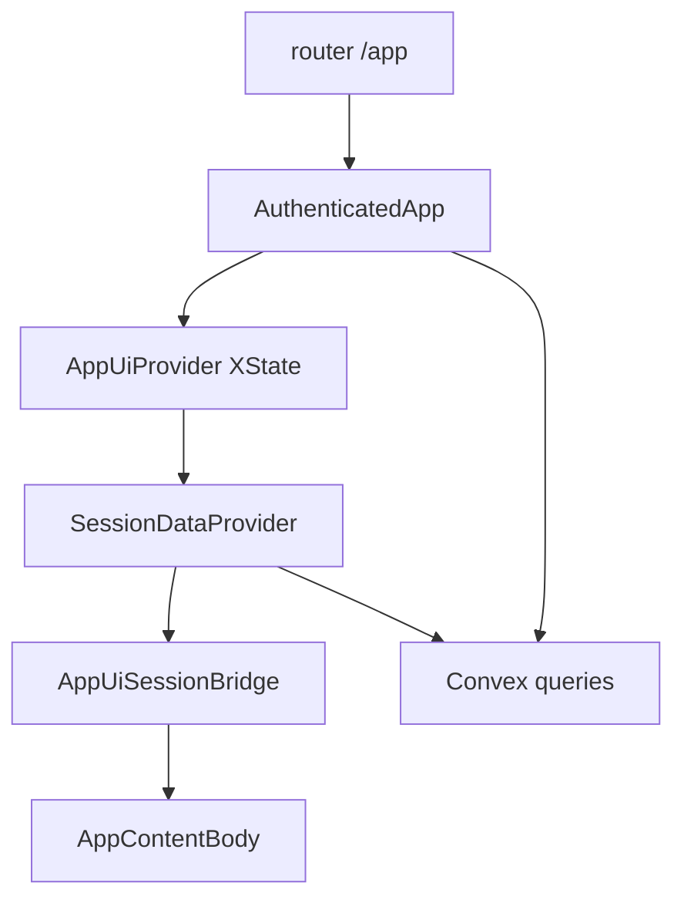

# let-think

let-think is a focused thinking workspace.  
Instead of only generating chat text, it turns each exchange into an evolving concept graph so you can branch ideas, revisit prior steps, and continue from specific concepts.

## Quick Start

1. **Install dependencies**
  ```bash
   npm install
  ```
2. **Initialize Convex** (creates `.env.local` with `VITE_CONVEX_URL`)
  ```bash
   npx convex dev
  ```
   This prompts sign-in, creates/selects a Convex project, and generates `convex/_generated`.
3. **Set Convex environment variables** (Dashboard → Project → Settings → Environment Variables, or `npx convex env set`)
  - `GOOGLE_GENERATIVE_AI_API_KEY` — Gemini for chat and concept graph generation
  - `GOOGLE_EMBEDDING_MODEL` — optional Google embedding model id(s) for concept-node vectorization (comma-separated fallback supported; default tries `gemini-embedding-001,text-embedding-004`)
  - `AUTH_GOOGLE_ID` and `AUTH_GOOGLE_SECRET` — Google OAuth (from [Google Cloud Console](https://console.cloud.google.com/apis/credentials))
  - `CONVEX_SITE_URL` — your app origin (e.g. `http://localhost:5173` locally, production site URL in prod); must match what you use in the browser for auth callbacks
  - `RESEND_API_KEY` and `RESEND_FROM_EMAIL` — required for transactional emails (allowlist approval)
  - `RESEND_REPLY_TO` — optional reply-to address for transactional emails
  - `WEAVIATE_URL` — Weaviate base URL (for concept-node vector sync)
  - `WEAVIATE_API_KEY` — optional API key/token for Weaviate auth
  - `WEAVIATE_COLLECTION` — optional target class/collection (default: `ConceptNode`)
4. **Run the app**
  ```bash
   npm run dev
  ```
   `npm run dev` starts both Vite and `npx convex dev` concurrently.

> **Agents / headless dev:** to reach the authenticated workspace without Google OAuth, see
> [docs/agent-local-login.md](docs/agent-local-login.md) (mints a real Convex Auth session on
> the local anonymous backend).

## Environment Variables


| Variable                       | Where                                                    | Description                                                                                                                                                         |
| ------------------------------ | -------------------------------------------------------- | ------------------------------------------------------------------------------------------------------------------------------------------------------------------- |
| `VITE_CONVEX_URL`              | `.env.local` (local); **Netlify build env** (production) | Convex deployment URL. Set automatically by `npx convex dev` locally. For static hosting, must be present **at build time** so Vite embeds it in the client bundle. |
| `CONVEX_SITE_URL`              | Convex Dashboard (per deployment)                        | Public origin of your app (`http://localhost:5173` in dev, production URL in prod). Used by `convex/auth.config.ts` for Convex Auth.                                |
| `GOOGLE_GENERATIVE_AI_API_KEY` | Convex Dashboard                                         | Server-side Gemini API key for chat actions and topic summaries.                                                                                                    |
| `GOOGLE_EMBEDDING_MODEL`       | Convex Dashboard (optional)                              | Embedding model(s) for concept-node vectorization. Comma-separated fallbacks are supported. Default tries `gemini-embedding-001,text-embedding-004`.              |
| `AUTH_GOOGLE_ID`               | Convex Dashboard                                         | Google OAuth client ID.                                                                                                                                             |
| `AUTH_GOOGLE_SECRET`           | Convex Dashboard                                         | Google OAuth client secret.                                                                                                                                         |
| `RESEND_API_KEY`               | Convex Dashboard                                         | Resend API key used by backend transactional emails.                                                                                                                |
| `RESEND_FROM_EMAIL`            | Convex Dashboard                                         | Verified sender for transactional emails (e.g. `Let Think <noreply@yourdomain.com>`).                                                                              |
| `RESEND_REPLY_TO`              | Convex Dashboard (optional)                              | Optional reply-to for transactional emails.                                                                                                                         |
| `WEAVIATE_URL`                 | Convex Dashboard                                         | Base URL for Weaviate instance used to store concept-node vectors.                                                                                                   |
| `WEAVIATE_API_KEY`             | Convex Dashboard (optional)                              | API key/token used as Bearer auth when calling Weaviate.                                                                                                            |
| `WEAVIATE_COLLECTION`          | Convex Dashboard (optional)                              | Weaviate class/collection name for concept vectors. Defaults to `ConceptNode`.                                                                                      |


Use the `VITE_` prefix only for client-safe values in `.env.local`. Secrets (`AUTH_*`, `GOOGLE_*`, `CONVEX_SITE_URL` for server) belong in Convex, not in the frontend env.

## Deployment (Netlify)

The repo includes `[netlify.toml](netlify.toml)`: build command `npm run build`, publish directory `dist`.

1. **Connect the repo** in Netlify and use the default settings from `netlify.toml` (or equivalent).
2. **Set `VITE_CONVEX_URL` in Netlify** under Site configuration → Environment variables → **Build** (or “All scopes” including builds). Use the Convex deployment URL for that environment:
  - **Production branch:** URL of your **production** Convex deployment (from the Convex dashboard).
  - **Deploy previews / branch deploys:** Either point at a **dev** Convex deployment used for previews, or add per-branch values if you use [Netlify’s multiple deploy contexts](https://docs.netlify.com/environment-variables/get-started/#scopes) so preview builds don’t call production Convex by mistake.
3. **Convex:** For each Convex deployment (dev/prod), set `CONVEX_SITE_URL` to the matching site origin (e.g. preview URL vs production domain) so OAuth redirects stay consistent.

If `VITE_CONVEX_URL` is missing at build time, the SPA will bundle an empty URL and fail to connect to Convex in the browser.

## App Tutorial (In-Product)

The onboarding tutorial is implemented in `src/components/onboarding/Tutorial.tsx` and launched automatically for first-time users.

It currently covers:

- Main workspace and graph-first flow
- Creating sessions and projects from the sidebar
- Switching between graph and project-notes list views
- Chat input with `@` concept references
- Wake-up note-taking and history navigation

You can replay it from the sidebar ("Run tutorial"), which dispatches the `let-think:run-tutorial` event.

## Architecture (Current)

### Frontend

- `src/main.tsx` wraps the app in `ConvexAuthProvider` and mounts TanStack Router (`src/router.tsx`).
- **Auth and public routes** live in `router.tsx`: root layout waits on Convex auth loading; `/` is landing vs redirect to `/app`; `/app` renders `src/components/auth/SignIn.tsx` or the authenticated workspace.
- `**src/App.tsx`** exports `AuthenticatedApp` only: the workspace shell (not the public/auth gate). It composes `AppUiProvider`, `SessionDataProvider`, `AppUiSessionBridge`, and `AppContentBody`.
- `AppUiProvider` runs an **XState** machine (`src/machines/appUiMachine.ts`); `useAppUi` / selectors coordinate view state (graph/list mode, overlays, selected batch, loading frames, history panel, editor state).
- `SessionDataProvider` (exported from `src/contexts/SessionDataContext.tsx`) loads session-bound data (messages, graph, interaction caps, timers, pagination).
- `src/bridge/AppUiSessionBridge.tsx` (with `sessionBridgeHooks.ts`) connects workspace/session data to the UI actor where needed.
- `src/components/app-shell/AppContentBody.tsx` composes the shell:
  - `src/components/session-sidebar/SessionSidebar.tsx` for projects/sessions/navigation actions
  - Graph/list surface (`AppContentGraphSurface` or `NotesListPanel` under `components/notes-list/`)
  - `components/chat/Chat.tsx` (or `HistoricalBatchPrompt` when browsing earlier graph batches)
  - Overlays (`onboarding/WakeUpOverlay`, walkthrough, `onboarding/Tutorial`)

Shared UI and feature code also live under grouped folders (for example `concept-graph-overlay/`, `user/`, `editor/`, `navigation/`, `marketing/`, `docs/`). Constants for layout, chat, and timings sit in `src/config/`.

### Backend (Convex)

- `convex/schema.ts` models:
  - `projects`, `sessions`, `messages`
  - `sessionConceptGraphs` (graph stored separate from session row)
  - interaction tracking tables for think/work mode
- `convex/sessions.ts` handles secure session/message CRUD, draft/notes persistence, paginated message history, and concept graph persistence.
- `convex/projects.ts`, `convex/users.ts` — projects listing and user-facing helpers.
- `convex/chat.ts` — chat actions (send, topic generation).
- `convex/chatPipeline.ts` defines LLM pre/post processing:
  - injects system prompt and optional selected-concept context
  - extracts concept graph JSON from assistant output
  - strips graph block from user-visible assistant text
- `convex/transactionalEmails.ts`, `convex/lib/transactionalEmails/` — internal action + templates/sender helpers for transactional email delivery.
- `convex/auth.ts`, `convex/auth.config.ts`, `convex/http.ts` — Convex Auth and HTTP routes.
- `convex/admin.ts`, `convex/modelConfig.ts`, `convex/constants.ts`, `convex/lib/access.ts` — admin, model configuration, shared constants, and access helpers.

### Runtime Flow

1. User sends prompt in `Chat`.
2. Backend action runs chat pipeline and persists user/assistant messages.
3. Extracted concept graph is merged/persisted per session.
4. UI re-renders graph + batch navigation; users can reference concept nodes via `@N` in the next prompt.

### Workspace composition (authenticated)

After `/app` resolves to the signed-in workspace, providers nest as below. The UI machine drives navigation and layout mode; `SessionDataProvider` loads Convex data for the active session; the bridge keeps the actor and session layer aligned.




## High-Level Structure

```
├── convex/
│   ├── schema.ts              # Data model + indexes
│   ├── sessions.ts            # Session/message queries and mutations
│   ├── projects.ts          # Projects and session grouping
│   ├── users.ts             # User helpers
│   ├── chat.ts              # Chat actions (send, topic generation)
│   ├── chatPipeline.ts      # LLM pre/post processing and graph extraction
│   ├── auth.ts              # Convex Auth functions
│   ├── auth.config.ts       # Auth configuration
│   ├── http.ts              # HTTP router (auth callbacks, etc.)
│   ├── admin.ts             # Admin / allowlist
│   ├── modelConfig.ts       # Model configuration
│   ├── constants.ts         # Shared backend constants
│   └── lib/access.ts        # Access control helpers
├── src/
│   ├── main.tsx               # ConvexAuthProvider + AppRouter
│   ├── router.tsx             # TanStack Router: public vs /app workspace
│   ├── App.tsx                # AuthenticatedApp (workspace providers only)
│   ├── bridge/                # AppUiSessionBridge, session bridge hooks
│   ├── machines/              # appUiMachine (XState) + types/reducers
│   ├── config/                # layout, chat, timings
│   ├── pages/                 # Landing, legal, admin pages
│   ├── components/
│   │   ├── app-shell/         # AppShell, AppContentBody, AppContentGraphSurface
│   │   ├── session-sidebar/   # SessionSidebar and sidebar pieces
│   │   ├── concept-graph-overlay/
│   │   ├── notes-list/
│   │   ├── chat/              # Chat, composer, history, historical prompt
│   │   ├── onboarding/        # Tutorial, WakeUpOverlay
│   │   ├── auth/              # SignIn
│   │   ├── user/              # User menu, cards, avatar
│   │   ├── editor/            # MarkdownEditor
│   │   ├── navigation/        # Breadcrumb, step navigator, pagination dots
│   │   ├── marketing/         # SiteFooter
│   │   ├── docs/              # LegalDocLayout
│   │   └── ui/                # Shared primitives (button, dialog, …)
│   ├── contexts/              # AppUiProvider, SessionDataContext, app UI actor
│   ├── hooks/                 # UI selectors, handlers, sync hooks
│   └── lib/                   # Storage, mentions, graph helpers, utilities
└── package.json               # Scripts and dependencies
```

